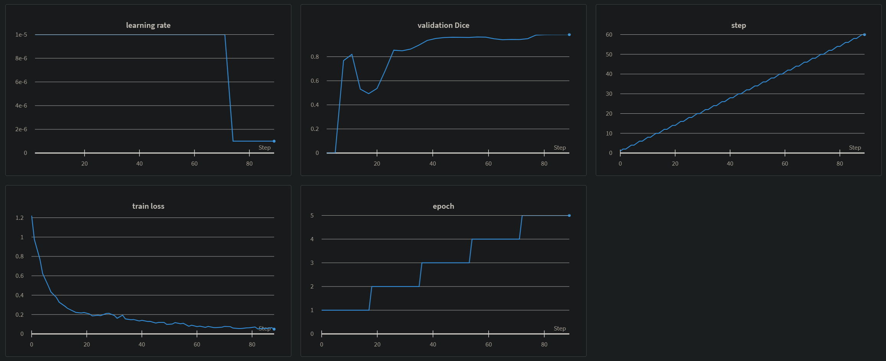

# Remove_facemask

There project was built by me, Alex and 證壹. 

We want build the applications to remove facemask by AI algorithm. 

Our goal is make the perfect performance to comaper with Pixel algorithm.

But recording our resouces including time, devices and :moneybag:.

We decided to :sparkles:open source:sparkles: the whole project.

So If you have fun or intersting with our project. 

Please give the :star: we will appreciate it.:relaxed:

Also you can reference our [slide](https://docs.google.com/presentation/d/181eFUYPN-8y2xmDHlhNQoEO019DoeQBaOG5oyBcysgQ/edit?usp=sharing).

## Architecture

There are four parts you can enjoy with them.

1. Detection the face wearing the mask.

2. Remove the face.

3. Generate the blank

4. Generate the mask (Optional)

## 1. Detection the face wearing the mask.

First git clone repo from yolo

```
git clone https://ultralytics.com/yolov5
```

### 1.1 Specification:
- Mask
- Face
- 929 images of 2 Classes
- Train Q’ty = 836
- Valid Q’ty = 66
- Test Q’ty = 27
- images size: 1024*1024 
- labels format: XML 

### 1.2 Datasets:
https://drive.google.com/drive/folders/1rDCEDGXvw8YS2cY7BgtQbfsjVi7fhlSm?usp=sharing


### 1.3 Steps

- Label the images [Detection]
labelme /your/path/ --labels labels.txt --nodata --autosave
- Press the right-click to select the rectangle
- After you have labeled all of the images. 
- Migrate json files to detection/labels/{face/mask} from detection/images/{face/mask}

- Transfer /your/path/*.json to *.xml [Detection]
py json_xml.py

### 1.4 Start the training with Yolov5 [Detection]

Run "detection.ipynb" on colab and run step by step.

### 1.5 Requirment

YOLOv5 🚀 requirements Usage: pip install -r requirements.txt

### pip packages 
```
gitpython
ipython  # interactive notebook
matplotlib>=3.2.2
numpy>=1.18.5
opencv-python>=4.1.1
Pillow>=7.1.2
psutil  # system resources
PyYAML>=5.3.1
requests>=2.23.0
scipy>=1.4.1
thop>=0.1.1  # FLOPs computation
torch>=1.7.0  # see https://pytorch.org/get-started/locally (recommended)
torchvision>=0.8.1
tqdm>=4.64.0
tensorboard>=2.4.1
pandas>=1.1.4
seaborn>=0.11.0
```


Our weight and data split
Can try our weight at path .\yolov5\runs\train\yolov5s_results

### 2. Segment the mask from the face
In this step, the objective is to remove the mask from the face.  
To achieve that, we use U-Net (source: https://github.com/milesial/Pytorch-UNet) to segment the mask from the face and cut the segmentation part.  
> The cutting part won't be including in this repo, you should do it yourself.

#### 2.1 Environment Setup
Run the following commands in your working directory
> Pls read the comments first

```sh
# Clone the U-Net repo
git clone https://github.com/milesial/Pytorch-UNet.git

# Create a new conda env, you can skip this step if you don't using conda.
conda create --name unetSeg python=3.8
connda activate unetSeg

# Install the PyTorch
## There are different ways to install PyTorch and its dependencies (like cuda), you can choose any of them, but make sure your PyTorch version should be 1.12 or later
## The following command is for Mac
conda install pytorch==1.12.1 torchvision==0.13.1 torchaudio==0.12.1 -c pytorch

# Install the requirements
cd Pytorch-UNet/
pip install -r requirements.txt
```

#### 2.2 Put the training data into the `data` folder
The input images and target masks should be in the data/imgs and data/masks folders respectively (note that the imgs and masks folder should not contain any sub-folder or any other files, due to the greedy data-loader).

> It might look like:  
>   

#### 2.3 Training
Run the following commands in the `Pytorch-UNet` folder.
```sh
python train.py
```

#### 2.4 Testing
```sh
python predict.py --model checkpoints/checkpoint_epoch5.pth --input path_to_test_img.png --output result.png
```
Check the result.png

#### 2.5 Charts for the training result
  


### 3. Generate the blank

We reference the project [generative_inpainting](https://github.com/JiahuiYu/generative_inpainting). 

But it's the older version. So it need some steps to update the version if you 

First off, you can install the project by gi_install.sh.

Second, becasue some issue with tf_upgrade_v2. You need to modify the code by yourself.

1. change the file [ inpaint_model.py ]
```
from tensorflow.contrib.framework.python.ops import arg_scope
-> from tf_slim import arg_scope
```
2. change the file [ inpaint_ops ]
```
from tensorflow.contrib.framework.python.ops import add_arg_scope
-> from tf_slim import arg_scope
```

Then install neuralgym
```
cd neuralgym
pip install -e .
cd ..
```
Download the weight from https://github.com/JiahuiYu/generative_inpainting#pretrained-models

Finally, you can test the code
```
python test.py --image examples/places2/case1_input.png --mask examples/places2/case1_mask.png --output examples/places2/case1_output_test.png --checkpoint_dir model_logs/release_places2_256_deepfill_v2
```
## 4. Generate the mask (Optional)

4.1 Imstall the gangealing
```
git clone https://github.com/wpeebles/gangealing.git
cd gangealing
conda env create -f environment.yml
conda activate gg
```

4.2 Set the environment parameters
```
export PYTHONPATH="${PYTHONPATH}:${PWD}"
```
4.3 Test the images
```
python prepare_data.py --input_is_lmdb --lsun_category cat --out data/lsun_cats --size 512 --max_images 10000
python applications/propagate_to_images.py --ckpt cat --real_data_path data/lsun_cats --real_size 512 --dset_indices 1922 2363 8558 7401 9750 7432 2105 53 1946
```
If it has a issue with "GLIBCXX_3.4.29" You can try the steps from [here](https://stackoverflow.com/questions/65349875/where-can-i-find-glibcxx-3-4-29)

4.4 The the image with facemask
It prove the human face and the mask you can use them at images folder
```
python prepare_data.py --path folder_of_images --out data/my_new_dataset --pad [center/border/zero] --size S # build the data
python applications/propagate_to_images.py --ckpt celeba --real_data_path data/my_new_dataset --real_size 512 --dset_indices 0
```
Or if you feel complicate on this job, you can try this [link](https://colab.research.google.com/drive/1JkUjhTjR8MyLxwarJjqnh836BICfocTu?usp=sharing) by office.

:raised_hands::fireworks::rocket:Just for fun for yourself! :raised_hands::fireworks::rocket: